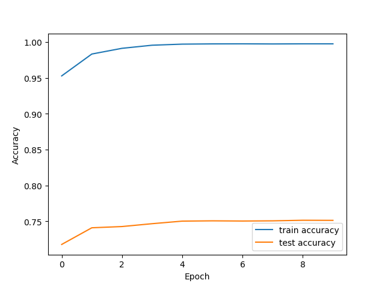

# EMNLP Assignment 1:Log-Linear Model for Text Classification

## Introduction

​		In our daily study and research,fancy deep NLP models like BERT and XLNet  are more and more popular,and machine learning packages  like tensorflow ,pytorch ,sklearn and nltk are used  frequently. Sometimes we may focus on API testing and hyper parameters tuning but ignore  preprocessing details,model architecture and updating algorithm. **In the assignment,I implemented a naive log-linear model for text classification from scratch without any machine learning tools or NLP packages. Using one-hot encoded  features as input and mini-batch gradient descent as the updating algorithm,my log-linear model reached 80.49% validation accuracy on 20-Newsgroups benchmark**. More details about my implementation are given below.

## Data preprocessing and feature extraction

### Data preprocessing

​		 In NLP, text preprocessing is the first step in the process of building a model. Without NLP preprocessing tools like NLTK and Standford NLP, **I implemented simple preprocessing routines including stop word removal, tokenization,lower casing and  lemmatization**.

For tokenization and string cleaning,I used the routine provided by Yoon Kim:

~~~python
def clean_str(string):
    """
    Tokenization/string cleaning for raw text
    Original taken from https://github.com/yoonkim/CNN_sentence/blob/master/process_data.py
    """
    string = re.sub(r"[^A-Za-z0-9(),!?\'\`]", " ", string)     
    string = re.sub(r"\'s", " \'s", string) 
    string = re.sub(r"\'ve", " \'ve", string) 
    string = re.sub(r"n\'t", " n\'t", string) 
    string = re.sub(r"\'re", " \'re", string) 
    string = re.sub(r"\'d", " \'d", string) 
    string = re.sub(r"\'ll", " \'ll", string) 
    string = re.sub(r",", " , ", string) 
    string = re.sub(r"!", " ! ", string) 
    string = re.sub(r"\(", " \( ", string) 
    string = re.sub(r"\)", " \) ", string) 
    string = re.sub(r"\?", " \? ", string) 
    string = re.sub(r"\s{2,}", " ", string)    
    return string.strip().lower()
~~~

For stop words removal,I get a list of stop words including 179 stop words like 'do','a','an' and delete them before turning sentences to one-hot encoded features.For lemmatization,I get a lemmaziation dict from https://github.com/michmech/lemmatization-lists/blob/master/lemmatization-en.txt to reduce inflectional forms and sometimes derivationally related forms of a word to a common base form. For instance:

> am, are, is  be
> car, cars, car's, cars'  car

The preprocessing functions are included in the file `utils.py`.

### Feature Extraction

For the sake of simplicity,I used **one-hot encoding vectors** as sentence representations.After doing preprocessing,I select **the top 20000 words with max frquency** as the con tent of my vocab and build the 'word to id' dict.For most sentences only include less than 200 words,**ont hot encoding representations will be sparse(most items of one sentence vector will be zero).To save memory and computing time,I only save the ids of the words in a sentence as its's real input feature.**The feature extracting function are given below.

~~~python
def get_features(train_file,test_file,demension=10000):
    '''
    extract features and labels from training and testing files
    demension(int): The number of the demension of the feature
    '''
    print("Building dictionary now……")
    dictionary = build_vocab(train_file)[:demension]
    print("Dictionary is done now")
    word2id = {}
    for id,item in enumerate(dictionary):
        word2id[item[0]] = id
    train_items,train_labels = read_csv(train_file)
    test_items,test_labels = read_csv(test_file)
    train_features = [ set() for i in range(len(train_items))]
    test_features = [ set() for i in range(len(test_items))]
    print("extracting training features")
    for id, item in tqdm(enumerate(train_items)):
        words = item.split()
        for word in words:
            if word in word2id.keys():
                train_features[id].add(word2id[word])
    print("extracting testing features")
    for id,item in tqdm(enumerate(test_items)):
        words = item.split()
        for word in words:
            if word in word2id.keys():
                test_features[id].add(word2id[word])
    return train_features,train_labels,test_features,test_labels,word2id
~~~

## The implementation of log-linear model

The parameters of the model is $w_{ij},0 \leq i \leq m-1, 0 \leq j \leq n-1 $(n is the number of classes,m is the demension number of feature vectors).For each possible $y$ of instance $x$,we can compute a score:
$$
score(x,y) = \sum_i w_{iy}f_i(x,y)
$$
Then ew can produce a probalistic model:
$$
p(y|x) = \frac{exp \ score(x,y)}{ \sum_{y'}exp \ score(x,y') }
$$
According to the course slide,we need to maximize:
$$
LL(\hat{w}) = \sum_k \hat{w}·f(x_k,y_k)-\sum_k log \sum_{y'} exp(\hat{w}·f(x_k,y')) 
$$
So the gradients w.r.t each $w$ can be written as:
$$
\frac{\partial LL(\hat{w})}{\partial w_i(x,y)} = \sum_kf_i(x_k,y_k) - \sum_k \sum_{y'}f_i(x_k,y')p(y'|x_k;\hat{w})
$$
After adding relular term to avoid overfitting,the gradient can be written as:
$$
\frac{\partial LL(\hat{w})}{\partial w_i(x,y)} = \sum_kf_i(x_k,y_k) - \sum_k \sum_{y'}f_i(x_k,y')p(y'|x_k;\hat{w}) - \alpha w_{f_i(x,y)}   \\
a \ is \ the \ regularization \ term \  coefficient
$$
So we could use gradient descent to update the parameters to fit the train set(The details will be given in the next sextion).I implemented the class `LogLinearModel` in `model.py` to make up the model:

~~~python
class LogLinearModel:
    '''
    The Log-Linear Model for text categorization
    '''
    def __init__(self,lr=0.1,n_classes=20,n_features=10000,lemma =1e-4):
        '''
        lr:learning rate
        n_classes:number of classes
        n_features:the demension of features
        lemma:regularization coefficient
        '''
        self.w = [ [0.00001 for i in range(n_features)] for i in range(n_classes)]
        self.n_classes = n_classes
        self.n_features = n_features
        self.lemma = lemma
        self.lr = lr
~~~

The parameters of the `__init__` function are given in the code block:

- `lr`:learning rate
- `n_classes`:The number of classes in the categorization task
- `n_features`:the demension of features
- `lemma`:regularization coefficient

The update algorithm and training routine will be discussed in the next section.

## The update algorithm

I used the mini-batch gradient descent as the update algorithm,which mean the parameters will be updated according to the sum of gradients drawn from a batch of samples one time.What I want to emphasize is I implemented the algorithm by only calculating the weights for exsiting words in the batch of the samples to get the score $p(y|x)$,because simply multipy the one-hot sparse vector and the weights vecotor will be unnecessarily time consuming.(WIth my optimization,the traing for 10 epochs can be completed in 2 minutes in a PC.)

The function for training with the given training set samples and batch size:

~~~python
    def train(self,samples,labels,batch_size=100):
        '''
        training for given data and the batch size
        '''
        idx = 0 
        for _ in tqdm(range(len(samples) // batch_size )):
            samples_batch = samples[idx:idx+batch_size]
            labels_batch = labels[idx:idx+batch_size]
            idx += batch_size 
            self.get_update(samples_batch,labels_batch)
            if idx >= len(samples):
                break
        return
~~~

The update function for a batch of samples is given below:

~~~python
    def get_update(self,samples,labels):
        '''
        Get coefficients updated for a mini-batch of samples
        '''
        _,scores_list = self.predict(samples)
        gradient = [ [0.0 for _ in range(self.n_features)] for _ in range(self.n_classes)]
        for id,sample in enumerate(samples):
            for word_id in sample:
                for clazz in range(self.n_classes):
                    if clazz == labels[id]:
                        gradient[clazz][word_id] += 1.0 - 1.0*scores_list[id][clazz]
                    else:
                        gradient[clazz][word_id] += 0.0 - 1.0*scores_list[id][clazz]
        for i in range(self.n_classes):
            for j in range(self.n_features):
                self.w[i][j] += self.lr*gradient[i][j] - self.lemma*self.w[i][j]
        return 
~~~

You can see that the list of $p(y|x)$probalities `scores_list` are calaulated by the function `predict`.The optmization mentioned before is done here.

~~~python
    def predict(self,samples):
        '''
        Get predict result of given samples 
        '''
        labels = []
        scores_list = []
        for sample in samples:
                scores = []
                max_tmp = 0 
                for clazz in range(self.n_classes):
                    tmp_score = sum([id*self.w[clazz][id] for id in sample])
                    max_tmp = max(max_tmp,tmp_score)
                    scores.append(tmp_score)
                scores = [ score - max_tmp for score in scores]
                scores  = [math.exp(score) for score in scores]
                s = sum(scores)
                scores = [score/s for score in scores]
                label = 0
                max_score = scores[0]
                for i in range(1,self.n_classes):
                    if scores[i] > max_score:
                        max_score = scores[i]
                        label = i
                labels.append(label)
                scores_list.append(scores)
        return labels, scores_list
~~~

## Evaluation

### Baseline for submission in run.sh

If you run the `run.sh` script,hyper parameters will be 0.01 for `lr` ,`0` for lemma,`200` for batch size and 20000 for `n_features`.After training for 10 epochs,**the accuracy on the training set is 99.75%,and the validation accuracy is 75.15%**.The changing states of the two metric are given in the two curves below:

### Hyper parameter tuning

The upper chart shows obvious over-fitting.To explore the effects of the the regularization term,batch_size and learing rate,I made an ablation study.You can get the results by `run ablation.py` and see the results in the `records.txt` file.(To save time,you can see `records.txt` directly).I test the following parameters:

- `lr`:0.001,0.01,0.1

- `batch_size`:100,200,1000,5000

- `lemma`:0,1e-4,1e-2,1e-1

To save space,I can't list all results here(It can be seen in `records.txt`,or at the end of this report**).The best test accuracy 80.49% comes when batch size = 10000,lr = 0.01,lemma = 0.01.It seems that adding a  regularization term and larger batch size can help solving over-fitting problem in the task**

## Conclusion and Thoughts

In the assignment,I implemented a naive log-liear model for text classification wihout any machine learning and NLP packages.Without the aid of popular packages,I need to do the preprocessing and updating alogrithm optimization from scratch with pure Python,which makes me more familiar with the common NLP task pipeline and Python programming.In future study,using pretrained word2vec features and more complex model like LSTM,Transformers and BERT can possibly improve the performance on the  20-Newsgroups benchmark significantly.

## Appendix

The hyper parameter tuning records:

~~~
batch size = 100,lr = 0.001,lemma = 0.0,best_acc = 0.7440254912373871
batch size = 100,lr = 0.001,lemma = 0.0001,best_acc = 0.7462825278810409
batch size = 100,lr = 0.001,lemma = 0.01,best_acc = 0.6881306425916092
batch size = 100,lr = 0.001,lemma = 0.1,best_acc = 0.5107541157727031
batch size = 200,lr = 0.001,lemma = 0.0,best_acc = 0.7437599575146043
batch size = 200,lr = 0.001,lemma = 0.0001,best_acc = 0.7417684545937334
batch size = 200,lr = 0.001,lemma = 0.01,best_acc = 0.7219861922464152
batch size = 200,lr = 0.001,lemma = 0.1,best_acc = 0.564922995220393
batch size = 1000,lr = 0.001,lemma = 0.0,best_acc = 0.771109930961232
batch size = 1000,lr = 0.001,lemma = 0.0001,best_acc = 0.7709771640998406
batch size = 1000,lr = 0.001,lemma = 0.01,best_acc = 0.7675252257036643
batch size = 1000,lr = 0.001,lemma = 0.1,best_acc = 0.719198088157196
batch size = 5000,lr = 0.001,lemma = 0.0,best_acc = 0.7980616038236856
batch size = 5000,lr = 0.001,lemma = 0.0001,best_acc = 0.7980616038236856
batch size = 5000,lr = 0.001,lemma = 0.01,best_acc = 0.798858204992034
batch size = 5000,lr = 0.001,lemma = 0.1,best_acc = 0.764073287307488
batch size = 100,lr = 0.01,lemma = 0.0,best_acc = 0.7438927243759957
batch size = 100,lr = 0.01,lemma = 0.0001,best_acc = 0.7399097185342538
batch size = 100,lr = 0.01,lemma = 0.01,best_acc = 0.6828199681359532
batch size = 100,lr = 0.01,lemma = 0.1,best_acc = 0.5115507169410515
batch size = 200,lr = 0.01,lemma = 0.0,best_acc = 0.7514604354753054
batch size = 200,lr = 0.01,lemma = 0.0001,best_acc = 0.7472118959107806
batch size = 200,lr = 0.01,lemma = 0.01,best_acc = 0.7193308550185874
batch size = 200,lr = 0.01,lemma = 0.1,best_acc = 0.5824482209240573
batch size = 1000,lr = 0.01,lemma = 0.0,best_acc = 0.7685873605947955
batch size = 1000,lr = 0.01,lemma = 0.0001,best_acc = 0.7677907594264471
batch size = 1000,lr = 0.01,lemma = 0.01,best_acc = 0.7648698884758365
batch size = 1000,lr = 0.01,lemma = 0.1,best_acc = 0.6964949548592672
batch size = 5000,lr = 0.01,lemma = 0.0,best_acc = 0.798858204992034
batch size = 5000,lr = 0.01,lemma = 0.0001,best_acc = 0.7984599044078597
batch size = 5000,lr = 0.01,lemma = 0.01,best_acc = 0.8004514073287308
batch size = 5000,lr = 0.01,lemma = 0.1,best_acc = 0.7624800849707913
batch size = 100,lr = 0.1,lemma = 0.0,best_acc = 0.7397769516728625
batch size = 100,lr = 0.1,lemma = 0.0001,best_acc = 0.7450876261285183
batch size = 100,lr = 0.1,lemma = 0.01,best_acc = 0.6735262878385555
batch size = 100,lr = 0.1,lemma = 0.1,best_acc = 0.5204460966542751
batch size = 200,lr = 0.1,lemma = 0.0,best_acc = 0.7523898035050451
batch size = 200,lr = 0.1,lemma = 0.0001,best_acc = 0.7466808284652151
batch size = 200,lr = 0.1,lemma = 0.01,best_acc = 0.7225172596919809
batch size = 200,lr = 0.1,lemma = 0.1,best_acc = 0.5779341476367499
batch size = 1000,lr = 0.1,lemma = 0.0,best_acc = 0.7699150292087095
batch size = 1000,lr = 0.1,lemma = 0.0001,best_acc = 0.7688528943175783
batch size = 1000,lr = 0.1,lemma = 0.01,best_acc = 0.7688528943175783
batch size = 1000,lr = 0.1,lemma = 0.1,best_acc = 0.6950345193839618
batch size = 5000,lr = 0.1,lemma = 0.0,best_acc = 0.7983271375464684
batch size = 5000,lr = 0.1,lemma = 0.0001,best_acc = 0.7985926712692512
batch size = 5000,lr = 0.1,lemma = 0.01,best_acc = 0.7997875730217737
batch size = 5000,lr = 0.1,lemma = 0.1,best_acc = 0.7615507169410515
batch size = 10000,lr = 0.001,lemma = 0.0,best_acc = 0.8046999468932554
batch size = 10000,lr = 0.001,lemma = 0.0001,best_acc = 0.8046999468932554
batch size = 10000,lr = 0.001,lemma = 0.01,best_acc = 0.8044344131704726
batch size = 10000,lr = 0.001,lemma = 0.1,best_acc = 0.787838555496548
batch size = 10000,lr = 0.01,lemma = 0.0,best_acc = 0.8041688794476899
batch size = 10000,lr = 0.01,lemma = 0.0001,best_acc = 0.8043016463090813
batch size = 10000,lr = 0.01,lemma = 0.01,best_acc = 0.8049654806160382
batch size = 10000,lr = 0.01,lemma = 0.1,best_acc = 0.7877057886351566
batch size = 10000,lr = 0.1,lemma = 0.0,best_acc = 0.8037705788635157
batch size = 10000,lr = 0.1,lemma = 0.0001,best_acc = 0.8035050451407328
batch size = 10000,lr = 0.1,lemma = 0.01,best_acc = 0.8040361125862985
batch size = 10000,lr = 0.1,lemma = 0.1,best_acc = 0.7874402549123739
~~~

